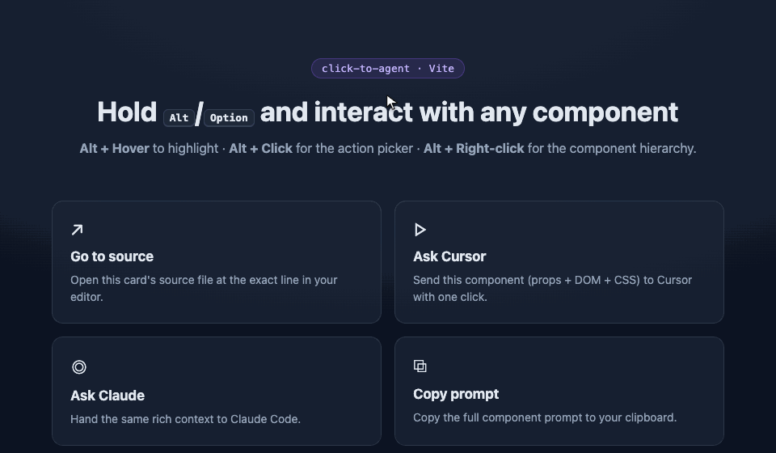
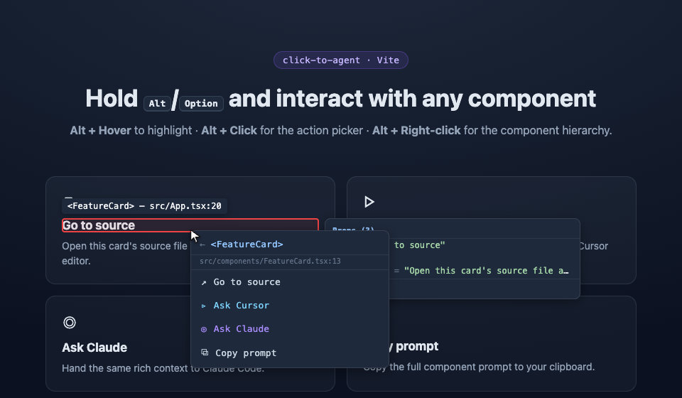

# click-to-agent

**Alt/Option + Click any React component to open its source — or hand it to your AI coding agent with full context.**

Zero-config for Next.js 15/16 with Turbopack and React 19. No Babel plugin, no browser extension, no setup.

<!-- TODO: Add demo GIF here -->
<!--  -->

> Fork of the excellent [`nextjs-locator`](https://github.com/stkang9409/nextjs-locator) by stkang9409 (MIT). `click-to-agent` keeps the source-locator core and adds first-class **"send this component to an AI coding agent"** actions (Cursor / Claude Code / clipboard).

## What you get

Hold the modifier key (Alt on Windows/Linux, Option on Mac) and interact with any component:

- **Alt + Hover** — highlight the component, show its name and resolved source path
- **Alt + Click** — open the action picker for that component
- **Alt + Right-click** — show the full component ancestry, then pick a component to act on

Every component exposes **four actions**:

| Action | What it does |
|--------|--------------|
| ↗ **Go to source** | Opens the source file at the exact line in your editor |
| ▹ **Ask Cursor** | Opens **Cursor** with a rich, pre-filled prompt about the component |
| ◎ **Ask Claude** | Opens **Claude Code** with a rich, pre-filled prompt about the component |
| ⧉ **Copy prompt** | Copies the full component prompt to your clipboard |

<!-- TODO: screenshot of the four-action picker -->
<!--  -->

For **Ask Cursor** / **Ask Claude**, a small modal asks for your instruction (e.g. *"make this button full-width and blue"*). The prompt handed to the agent includes:

- Component name, source file path, and line number
- Current props (JSON)
- Hook state — `useState` / `useReducer` / `useMemo` / `useRef` — or class component state (JSON)
- The rendered DOM HTML
- Key computed CSS (layout, spacing, color, typography, etc.)

So the agent lands on the right file with everything it needs to make a targeted edit.

## How it routes to each agent

| Target | Mechanism |
|--------|-----------|
| Cursor | `cursor://anysphere.cursor-deeplink/prompt?text=…` deeplink |
| Claude Code | `vscode://anthropic.claude-code/open?prompt=…` deeplink |
| Copy | Clipboard API (with a legacy `execCommand` fallback) |

Deeplink prompts are capped at ~28k encoded characters; if a component's context is larger, the DOM HTML is shrunk (and dropped if still too large) so the link stays valid. The **Copy prompt** action always copies the full, untruncated prompt.

## Installation

```bash
npm install click-to-agent
# or
yarn add click-to-agent
# or
pnpm add click-to-agent
```

## Quick Start

### Next.js App Router

```tsx
// app/layout.tsx
import { Locator } from 'click-to-agent';

export default function RootLayout({ children }: { children: React.ReactNode }) {
  return (
    <html>
      <body>
        {children}
        <Locator />
      </body>
    </html>
  );
}
```

### Next.js Pages Router

```tsx
// pages/_app.tsx
import { Locator } from 'click-to-agent';
import type { AppProps } from 'next/app';

export default function App({ Component, pageProps }: AppProps) {
  return (
    <>
      <Component {...pageProps} />
      <Locator />
    </>
  );
}
```

`<Locator />` renders nothing and is only active in development — it is completely tree-shaken from production builds.

## Keyboard & Mouse

| Shortcut | Action |
|----------|--------|
| **Alt + Hover** | Highlight component with name and source path |
| **Alt + Click** | Open the four-action picker for that component |
| **Alt + Right-click** | Show the component hierarchy, then pick a component |
| **Arrow Up / Down** | Navigate menu items |
| **Enter** | Select |
| **Escape** | Dismiss |

> On Mac, use **Option** instead of Alt.

## Props

| Prop | Type | Default | Description |
|------|------|---------|-------------|
| `editor` | `EditorProtocol` | `'vscode'` | Editor used by **Go to source** |
| `modifier` | `'alt' \| 'ctrl' \| 'meta' \| 'shift'` | `'alt'` | Modifier key to activate |
| `highlightColor` | `string` | `'#ef4444'` | Overlay border color (CSS color) |
| `projectRoot` | `string` | — | Absolute project root path (for path resolution) |
| `enabled` | `boolean` | `true` in dev | Force enable/disable |
| `showPreview` | `boolean` | `true` | Show props/state preview panel on Alt+hover |

### Editor support (Go to source)

| Editor | `editor` value | Protocol |
|--------|----------------|----------|
| VS Code | `'vscode'` | `vscode://file` |
| Cursor | `'cursor'` | `cursor://file` |
| VS Code Insiders | `'vscode-insiders'` | `vscode-insiders://file` |
| WebStorm | `'webstorm'` | `webstorm://open?file=` |
| Zed | `'zed'` | `zed://file` |

```tsx
<Locator editor="cursor" />
```

> **Ask Cursor** and **Ask Claude** route through their own deeplinks and do not depend on the `editor` prop — that prop only controls which editor **Go to source** opens.

## Configuration

### Project root

If source map paths don't resolve correctly (e.g. monorepos or custom setups), set the project root:

```tsx
<Locator projectRoot="/Users/you/projects/my-app" />
```

```bash
# .env.local
NEXT_PUBLIC_PROJECT_ROOT=/Users/you/projects/my-app
```

### Custom modifier key

```tsx
<Locator modifier="ctrl" />    {/* Ctrl+Click */}
<Locator modifier="meta" />    {/* Cmd+Click (Mac) / Win+Click */}
<Locator modifier="shift" />   {/* Shift+Click */}
```

### Custom highlight color

```tsx
<Locator highlightColor="#3b82f6" />   {/* Blue */}
<Locator highlightColor="#10b981" />   {/* Green */}
```

## How It Works

1. Listens for **modifier key + mousemove** to find the DOM element under the cursor.
2. Traverses the **React Fiber tree** via the `__reactFiber$` internal key.
3. Resolves the original source in priority order:
   - `data-locator-source` attribute (instant, if a compile-time injector is used)
   - `_debugSource` (React 18, synchronous)
   - `_debugStack` + source map (React 19, async with prefetch)
4. **Prefetches source maps** on modifier keydown — external `.map` files and inline `data:` URIs alike.
5. **Decodes mappings** via [`@jridgewell/trace-mapping`](https://github.com/jridgewell/trace-mapping) (`AnyMap`) to resolve the original file, line, and column. Handles both Turbopack's *sectioned* maps (Next.js) and the standard maps Vite/webpack emit.
6. Displays the path in a tooltip and (optionally) a props/state preview panel.
7. **Alt+Click** opens the four-action picker; **Alt+Right-click** opens the component hierarchy.

## Props / State preview

When hovering with the modifier key held, a preview panel shows:

- **Props** — current prop values (excluding `children`)
- **Hook state** — `useState`, `useReducer`, `useMemo`, `useRef`
- **Render count** — how many times the component has been inspected

Disable with:

```tsx
<Locator showPreview={false} />
```

## Requirements

- **React** >= 18.0.0 (React 19 fully supported)
- **Next.js** 13+ (App Router recommended) — also works with webpack builds
- **Development mode** only (completely removed in production)

## TypeScript

```typescript
import type { LocatorProps, EditorProtocol, AgentTarget, FiberInspection } from 'click-to-agent';
```

## Credits

`click-to-agent` is a fork of [`nextjs-locator`](https://github.com/stkang9409/nextjs-locator) by **stkang9409**. Huge thanks for the original source-locator engine (React Fiber traversal, Turbopack source map decoding, multi-editor support). This fork focuses on the AI-coding-agent workflow.

## License

[MIT](./LICENSE) — original work © 2025 stkang9409, fork © 2026 stekovinbranturry.
